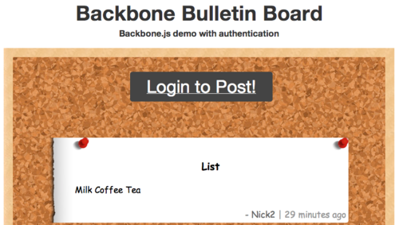

Single page web apps rule, but adding user logins (aka authentication) to them can be a bit frustrating for new app developers.  To give a little guidance we have constructed a bulletin board app to demonstrate how to make user logins a part of your Backbone.js applications. You can find the github repository [here](https://github.com/jeffj/backbone-bulletin-board/).

[](http://sfdevlabs.com:3000/)

See the 
[demo](http://sfdevlabs.com:3000/)
 here.

**We will hit the high points below.**

1) Adding Passport.js to the [Express.js web server](http://expressjs.com/) is a breeze.  Passport gives you session management and handles the user table in our Mongo database.  Github and Twitter login are added for free too.  

The functions for adding in passport.js are listed below. We have our authenticate functions in [config/passport](https://github.com/jeffj/backbone-bulletin-board/blob/master/config/passport.js)  (advanced developers) for our different login types.

[Passport extends](http://passportjs.org/guide/configure/) each express request with a user object. The _req.user _contains usernames, id, and further user info.

```javascript
// use passport session
app.use(passport.initialize())
app.use(passport.session())

app.use(app.router);

app.configure('development', function () {
  app.use(express.errorHandler());
});


require('./config/passport')(passport, config)

routes.init(app, auth, passport);
```
*app.js: A couple of functions to add passport to your express app.*

2)  In our CRUD utilities we use our auth instance object (which we import from config/middlewares/authorization.js ) to check if a logged in user has permission to edit and delete endpoints for specific posts (_auth.post.hasAuthorization_).  This uses the [express middleware paradigm](http://expressjs.com/api.html#app.VERB). We can  also make sure a user is logged in to make a new post (_auth.requiresLogin_).

```javascript
  exports.initRoutesForModel = function (options) {
    var app = options.app,
      model = options.model,
      auth= options.auth,
      path,
      pathWithId;

    if (!app || !model) {
      return;
    }

    path = options.path || '/' + model.modelName.toLowerCase();
    pathWithId = path + '/:id';
    app.get(path, getListController(model));
    app.get(pathWithId, getReadController(model));
    app.post(path, auth.requiresLogin, getCreateController(model));
    app.put(pathWithId, auth.requiresLogin, auth.post.hasAuthorization, getUpdateController(model));
    app.del(pathWithId, auth.requiresLogin, auth.post.hasAuthorization, getDeleteController(model));
    app.param('id', postid)
  };

}(exports));
```

*utils/crudUtils.js: Notice the auth methods we use in routes for our CRUD utilities.*

Our authentication helper methods are found in our auth obj.  These methods come from our [_authorization.js helper methods_](https://github.com/jeffj/backbone-bulletin-board/blob/master/config/middlewares/authorization.js) (seen below).  They are simple logical checks for post ownership and logged in state.

```javascript
/*
 *  Generic require login routing middleware
 */
exports.requiresLogin = function (req, res, next) {
  if (!req.isAuthenticated()) {
    return res.send('{status:Requires Authentication}', 404);
  }
  next()
};
/*
 *  Post authorizations routing middleware
 */
exports.post = {
    hasAuthorization : function (req, res, next) {
      if (req.post.user.id != req.user.id) {
        return res.send('{status:Requires Authentication}', 404);
      }
      next()
    }
}
```


*config/middleware/authorization.js:  Our basic logic compares the user ID with post’s author to verify edit/delete permission.*

3) Our getListController function in the crudUtils.js [queries](http://mongoosejs.com/docs/api.html#model_Model.find) our mongo database (with the [mongoose](http://mongoosejs.com/) ORM) and sends the most recent posts to the backbone client. It needs to iterate over each post to see if it is made by the logged in user. This will populate a “myPost” boolean which will be used by backbone and our template to verify if a user can edit or delete a post.

```javascript
function getListController(model) {
  return function (req, res) {
    //console.log('list', req.body);
    model
      .find({})
      .populate("user", "username")
      .sort("createdAt")
      .lean()
      .exec(function (err, result) {
      if (!err) {
        var json;
        json=parseResults(result, req.user); //adds a myPost key for the post the user ownes
        res.send(json);
      } else {
        res.send(errMsg(err));
      }
    });
  };
}

function parseResults(result, user){ //Check if the logged in user is the author.
var id 
if (user) id=user._id; //setting the id if it exists;
 for (var i = result.length - 1; i >= 0; i--) { //check if the id matches the user.
    if(String(id)==result[i].user || String(id)==result[i].user._id)
      result[i].myPost=true;
    else
      result[i].myPost=false;
  };
```

*utils/crudUtils.js: The function parseResults goes through the posts and identifies if the current user is the author. Then myPost is added to the JSON result.*

4) Finally [Backbone Sync](http://backbonejs.org/#Sync) fetches the data from our [CRUD utility](https://github.com/jeffj/backbone-bulletin-board/blob/master/utils/crudUtils.js "CRUD") (see the JSON [here](http://sfdevlabs.com:3000/post)).

```json
{
  "user": {
    "username": "jdavid",
    "_id": "51ae581e3114117313000002"
  },
  "_id": "51ae58283114117313000003",
  "createdAt": "2013-06-04T21:11:42.660Z",
  "body": "double woot",
  "title": "woot",
  "__v": 0,
  "myPost": false
}
```

The [Backbone.js template](http://backbonejs.org/#View-render) uses the myPost boolean to display the correct UX controls depending on the post’s owner.

```html
  <div class="view">
    <div class="border"></div>
    <div class="control-box">
    <% if (myPost == true) { %>
    <a class="edit" href="javascript:null;" class="destroy">&#9998;</a>
    <a class="destroy" href="javascript:null;" class="destroy">&#10006;</a>
    <% } %> 
    </div> 
    <h3 class="title"><%= title %></h3>
    <div class="body"><%= body %></div>
    <input class="title-edit" placeholder"Title"></input>
    <br>
    <textarea class="body-edit" placeholder"Body"></textarea>
    <div class="bottom-label">
    <span class="username" ><%= user.username %></span>
    <span class="timestamp"><%= timeAgo %></span>
    </div>
    <button href="javascript:null;"class="submit-update">Update</button>  
  </div>
```

Hopefully this demo lets you wrap your head around building a single page webapp with user logins. Check out the [demo](http://sfdevlabs.com:3000/) and fork the [repository](https://github.com/jeffj/backbone-bulletin-board) on [Github](http://Github.com). 

Created by me [@jeffj](http://twitter.com/jeffj) at [@sfdevlabs](https://twitter.com/sfdevlabs "@sfdevlabs")