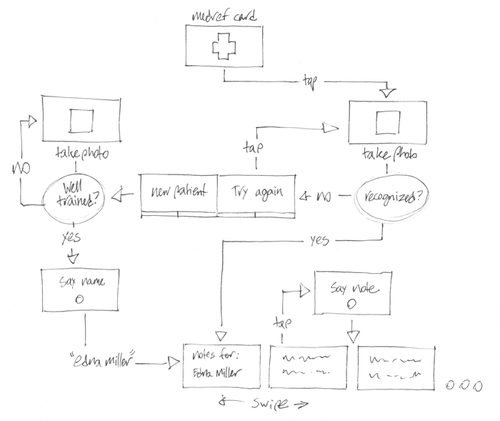

At a hackathon last week, I helped with the design of a Google
Glass app. Medref is an app to allow doctors to take notes on patients in a hospital and review them, based entirely on facial recognition of the patient.

The device doesn’t really “augment reality” in the way some
people might imagine. The hardware experience is basically like having
a wristwatch sized screen mounted a foot away from your face, with a
touchpad taped to the side of your head. Of course, Glass packages this
in a much nicer way.

You put the device on, and tap the touchpad to wake it. The
screen lights up with the time, and there is a microphone with the
words “ok glass”. At this point, if you say “ok glass”, you land on a
menu with a few different options. The menu can be scrolled up and down
by tilting your head, which is a pretty cool feature. Options on the
menu can be selected by speaking the right word.

Cards can’t hold much more than a short sentence’s worth of
information, or a few simple infographics. The inputs are voice, and
swiping and tapping on the touchpad. An input that was largely a
gimmick on tablets, the accelerometer, is actually pretty useful on
Glass, because it is one of the few available and we are good at
tilting out heads precisely. Another input is voice, which is quite
important, as it is the only way of getting any amount of information
into the device.

**The experience we designed**

The user starts by navigating to the MedRef card in their
timeline.

Upon tapping the card, the device takes a photo and sends it
to the server.

If the photo matches somebody in the MedRef database, the user
is shown a bundle of cards with the patient’s notes. They are then able
to swipe through the bundle and review the notes. If they tap on one of
these cards, they are able to add a note immediately after the current
card.

If the photo does not match, the user is presented a “Try
again” card and a “New patient” card. Tapping on the “Try again” card
is self explanatory. Tapping on the “New patient” card sends the photo
to the MedRef server. If the photo is good enough to train the facial
recognition algorithm, the user is prompted to say the patient’s name.
When the name is inputted successfully, the user is taken to a new
bundle of cards where they can add notes.

How it actually turned out

We decided to build the app using the Mirror API, instead of
building a native app. This is an API for interacting with a Glass
device from a server. We decided to use Mirror because it seemed
simpler, and you can’t currently install native apps on a Glass device
without putting it into debug mode. However, we had to modify the
original design quite a bit.

Google provides a pretty good summary of the basic
interactions available in the Mirror API:

> Information on Google Glass is separated into items on a
>     timeline. The timeline contains items or “cards” that display
>     information to the user. Users navigate through their timeline by
>     swiping backwards and forwards on Glass, revealing cards in the
>     past and future.
> 
> Each timeline card contains information pushed to Glass
>     devices from various pieces of Glassware. In addition, there are
>     default timeline cards that are “pinned” to a timeline, so they
>     always appear in the same place. The card that displays the current
>     time and the card that displays all of the tasks that Glass can
>     execute are examples of pinned cards.
> 
> Many timeline cards have additional interactions
>     associated with them that are accessible with a single tap. You can
>     define these menu items to allow users to execute actions such as
>     deleting or sharing a card.

There were a couple of factors in the Mirror API that kept us
from building the app as it was originally designed.

First of all, it is not possible to take a photo inside of a
Mirror app. Photos need to be taken from the built in camera app, and
can then be shared with contacts. So instead of having the facial
recognition happen inside MefRef’s experience, we added MedRef contacts
to which you must send a photo.

Second, you can not insert new cards directly into the
experience. The Mirror API sends new cards to a user’s timeline. This
means that the user must navigate back and sort through their timeline
to see the relevant information.

Here’s the developer, Lance Nanek, demoing the app:

<iframe frameborder="0" height="277" src=
"http://www.youtube.com/embed/E1aeMJY1AO0" width="493"></iframe>

You install the app and it places a MedRef card in your
timeline, and creates two MedRef contacts in your address
book.

The contacts are new patient and face search.

To create a new patient, the user takes a photo with the
camera app and shares it to the new patient contact. Medref then sends
back a bundle of cards for that patient to the user’s timeline. The
user must then find that bundle in the timeline. There, they can add
voice notes.

To search for a patient with facial recognition, the user
takes a picture with the camera and sends it to the face search
contact. Medref then returns a bundle of cards with percent matches on
faces already in the database. The user can select one, at which point
the bundle of cards matching that patient are sent to the
timeline.

The MedRef card allows the user to do a voice search. The
process is similar to the face search described above, but the user
just says the patients name instead.

As you can see, the experience is quite convoluted and is very
bound into the glass system interface. On the whole, there is a lot of
fondling of the touchpad and swiping around in bundles and timelines.
You need to navigate to completely different parts of the interface to
access the data that you just requested.

It’s best to think of the Mirror API in the same way as the
pulldown notification menu on an Android phone. In fact, the
capabilities of both mediums are about the same. It will be a great
companion for many native apps, but stretching it to try to build an
app for a specific purpose is a frustrating exercise.